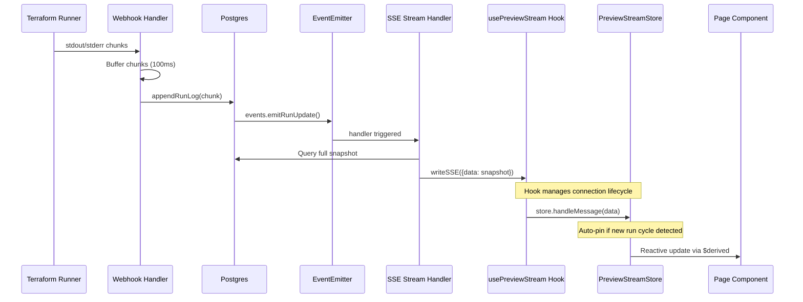
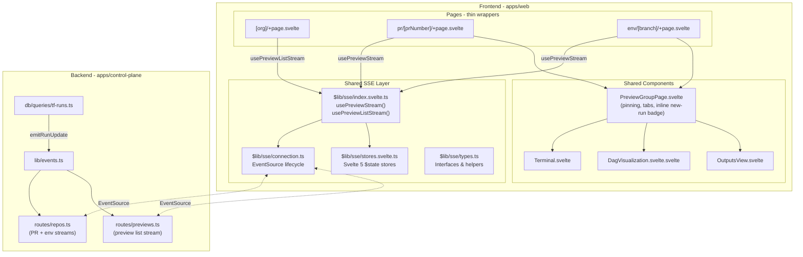

# Real-Time Streaming Architecture

This document describes Yaffle's real-time update system for streaming terraform
run logs and status updates to the UI.

## Functional Requirements

1. **Live log streaming** - Terraform stdout/stderr flows to the terminal UI in
   real-time as the run executes
2. **Status updates** - Preview and run status changes reflect immediately in
   the UI without refresh
3. **Multi-subscriber** - Multiple browser tabs viewing the same preview should
   all receive updates
4. **Tab lifecycle** - Connections should be managed across tab visibility
   changes (alt-tab, minimize)
5. **Resilience** - Network interruptions should reconnect gracefully
6. **Run pinning** - Users can continue viewing a specific run while new runs
   start on newer commits, with auto-pin on new run cycles

---

## Architecture

### Design Principles

1. **Single source of truth** - One SSE hook, not per-page implementations
2. **Svelte 5 native** - Use `$state` and `$effect` runes with proper lifecycle
3. **Run ID pinning** - Pin by run ID (stable) not SHA (changes on push)
4. **Auto-pin on new cycle** - When a new plan arrives while viewing a completed
   run, automatically pin to the old run so the view stays stable
5. **Full snapshots** - Keep simple snapshot approach, instrument for future
   optimization

### Data Flow



### Component Layout



---

## Key Decisions

### Decision 1: Run ID Pinning With Auto-Pin

**Problem:** SHA-based pinning blocks all updates when SHA changes, including
logs for the current run.

**Solution:** Pin by `runId` instead. Run IDs are stable - they don't change
when new commits arrive. The store automatically pins to the old run when a
new run cycle starts, so the user's view stays stable.

```typescript
// PreviewStreamStore (stores.svelte.ts)
class PreviewStreamStore {
  data = $state<PreviewGroup | null>(null)
  viewedRunId = $state<string | null>(null)
  pinnedHeadSha = $state<string | null>(null)

  handleMessage(payload: unknown): void {
    // Auto-pin: if unpinned and we already have data, check if a new run
    // cycle started (new plan appeared that wasn't there before)
    if (!this.viewedRunId && this.data) {
      for (const newWs of typed.data.workspaces) {
        const oldWs = this.data.workspaces.find(...)
        const oldLatestPlan = oldWs.runs.find((r) => r.runType === "plan")
        const newLatestPlan = newWs.runs.find((r) => r.runType === "plan")

        if (newLatestPlan?.id !== oldLatestPlan?.id
            && (oldLatestPlan.status === "success" || oldLatestPlan.status === "failed")) {
          this.viewedRunId = oldLatestPlan.id     // Pin to old plan
          this.pinnedHeadSha = this.data.headSha  // Snapshot the old SHA
          break
        }
      }
    }
    this.data = typed.data  // Live data always updated
  }

  get hasNewerRun(): boolean {
    if (!this.viewedRunId || !this.data) return false
    // Check if any workspace's latest run differs from the pinned one
    for (const ws of this.data.workspaces) {
      if (ws.runs[0]?.id !== this.viewedRunId) {
        const viewedExists = this.data.workspaces.some((w) =>
          w.runs.some((r) => r.id === this.viewedRunId))
        if (viewedExists) return true
      }
    }
    return false
  }

  switchToLatest(): void {
    this.viewedRunId = null
    this.pinnedHeadSha = null
  }
}
```

**How pinning flows to the UI (PreviewGroupPage):**

```typescript
// PreviewGroupPage.svelte
// Find pinned run across ALL workspaces (not just selected)
const pinnedRun = $derived.by((): Run | null => {
  if (!viewedRunId) return null
  for (const ws of workspaces) {
    const run = ws.runs.find((r) => r.id === viewedRunId)
    if (run) return run
  }
  return null
})

// Use timestamp as boundary to filter runs across all workspaces
const pinnedBoundary = $derived(pinnedRun?.createdAt ?? null)

const visibleRuns = $derived.by((): Run[] => {
  const runs = selectedWorkspace?.runs ?? []
  if (!pinnedBoundary) return runs
  return runs.filter((r) => r.createdAt <= pinnedBoundary)
})
```

**Why this works:**

- Logs always flow because `data` is always updated from SSE
- Auto-pin keeps the user's view stable when a new push arrives
- `pinnedBoundary` (timestamp) works across workspaces when switching sidebar
- User sees inline badge in workspace header, clicks to unpin and see latest
- `pinnedHeadSha` ensures the header shows the old commit's SHA while pinned

### Decision 2: Full Snapshots With Instrumentation

**Decision:** Keep full snapshot approach for v1, but **instrument from day one**
so we know before it becomes a problem.

**Why full snapshots:**

- Self-healing: sync issues auto-correct on next snapshot
- Single code path: easier to debug
- `lastPayload` dedup prevents sending unchanged data
- Real bugs are connection lifecycle, not snapshot efficiency

#### Required Instrumentation (Ship with v1)

| Question                                          | Metric                                 | Alert Threshold |
| ------------------------------------------------- | -------------------------------------- | --------------- |
| How many snapshot queries/sec during active runs? | `db.queries.sse_snapshot.rate`         | > 50/sec        |
| What's the p95 latency of snapshot queries?       | `db.queries.sse_snapshot.duration_p95` | > 100ms         |
| How large are SSE payloads?                       | `sse.payload.bytes` histogram          | p95 > 50KB      |
| How many concurrent SSE connections?              | `sse.connections.active` gauge         | > 100           |
| Are we dropping events due to backpressure?       | `sse.events.dropped` counter           | > 0             |

**Status:** Metrics are implemented in `repos.ts` (PR + env streams) with OTel
counters for snapshot duration, payload bytes, messages sent/deduped, and
connections active. `previews.ts` has partial instrumentation (missing connection
counting). `environments.ts` and `orgs.ts` have no SSE-specific metrics yet.

#### When to Optimize

The future incremental approach is triggered when we observe:

- Snapshot query rate > 50/sec sustained
- Query p95 latency trending upward
- Payload sizes growing (more runs, more log history)
- User-reported lag in log streaming

**The optimization is already designed** (see "Future Optimization" section) -
we flip the switch when metrics tell us to.

### Decision 3: Hook-Style API With Getter Functions

**API:**

```typescript
// Parameters are getter functions so $effect can track reactive changes
const stream = usePreviewStream(
  () => org,
  () => repo,
  "pr",
  () => prNumber,
)
```

**Why getter functions:** Svelte 5 `$effect` tracks reactive reads at call time.
Passing getter functions lets the effect re-run when `$page.params` change
(e.g., navigating between PRs), automatically tearing down the old connection
and creating a new one.

**Implementation structure:**

```
$lib/sse/
├── index.svelte.ts       # Public API: usePreviewStream, usePreviewListStream
├── connection.ts          # SSEConnection class: EventSource lifecycle
├── stores.svelte.ts       # PreviewStreamStore, PreviewListStore ($state)
└── types.ts               # Interfaces, helper functions
```

Note: files using Svelte 5 runes (`$state`, `$effect`) outside `.svelte` files
must use the `.svelte.ts` extension.

---

## Hook API Reference

### usePreviewStream

For PR and environment detail pages.

```typescript
function usePreviewStream(
  getOrg: () => string,
  getRepo: () => string,
  type: "pr" | "env",
  getId: () => string | number,
): {
  readonly data: PreviewGroup | null
  readonly connectionState: "connecting" | "connected" | "disconnected"
  readonly isStreaming: boolean
  readonly viewedRunId: string | null
  readonly hasNewerRun: boolean
  readonly pinnedHeadSha: string | null
  switchToLatest: () => void
}
```

### usePreviewListStream

For org dashboard page.

```typescript
function usePreviewListStream(getOrg: () => string): {
  readonly previews: Preview[]
  readonly connectionState: "connecting" | "connected" | "disconnected"
}
```

### Connection Lifecycle

Managed by the `SSEConnection` class (`connection.ts`):

- **Connect** on mount / when params change
- **Disconnect** when tab hidden (visibility API)
- **Reconnect** when tab visible again (resets backoff)
- **Reconnect** on error with exponential backoff (1s, 2s, 4s, 8s, max 30s)
- **Cleanup** on unmount or param change (via `$effect` cleanup function)
- **Stale guard** - event handlers check `this.es !== es || this.destroyed`
  before acting, preventing callbacks from stale EventSource instances

---

## Svelte 5 Reactivity Pattern

A critical pattern discovered during implementation: Svelte 5 `$props()`
destructuring breaks `$derived` chains. Components receiving frequently-changing
props (e.g., from SSE updates) must use explicit derivation:

```typescript
// BROKEN: downstream $derived chains don't re-evaluate
let { workspaces, streaming } = $props()

// CORRECT: explicit derivation ensures reactivity flows
let props: Props = $props()
const workspaces = $derived(props.workspaces)
const streaming = $derived(props.streaming ?? false)
```

Similarly, xterm.js Terminal instances created in async `onMount` must be
`$state` so that `$effect` blocks depending on them re-run:

```typescript
// BROKEN: $effect with early return on null never re-runs after onMount sets term
let term: Terminal | null = null

// CORRECT: $effect detects the state change and re-runs
let term = $state<Terminal | null>(null)
```

All components receiving SSE-driven props use this pattern:
`PreviewGroupPage`, `WorkspaceSidebar`, `Terminal`, `OutputsView`, `PlanSummary`.

---

## Page Components

### PR Page

```svelte
<!-- [org]/[repo]/pr/[prNumber]/+page.svelte -->
<script lang="ts">
  import { page } from "$app/stores"
  import { usePreviewStream } from "$lib/sse/index.svelte"
  import type { PrPreviewGroup } from "$lib/api"
  import PreviewGroupPage from "$lib/components/PreviewGroupPage.svelte"

  const org = $derived($page.params.org ?? "")
  const repo = $derived($page.params.repo ?? "")
  const prNumber = $derived(Number($page.params.prNumber) || 0)

  const stream = usePreviewStream(() => org, () => repo, "pr", () => prNumber)
  const displayData = $derived(stream.data as PrPreviewGroup | null)
</script>

{#if stream.connectionState === "connecting" && !displayData}
  <div>Loading...</div>
{:else if displayData}
  <PreviewGroupPage
    type="pr"
    {org}
    repo={displayData.repo}
    identifier={displayData.prNumber}
    branch={displayData.branch}
    headSha={stream.pinnedHeadSha ?? displayData.headSha}
    authorLogin={displayData.authorLogin}
    workspaces={displayData.workspaces}
    {githubUrl}
    streaming={stream.isStreaming}
    viewedRunId={stream.viewedRunId}
    hasNewerRun={stream.hasNewerRun}
    latestHeadSha={displayData.headSha}
    onSwitchToLatest={stream.switchToLatest}
  />
{:else}
  <div>No preview data found for this PR.</div>
{/if}
```

Key: `headSha` uses `stream.pinnedHeadSha ?? displayData.headSha` so the
header shows the pinned commit when auto-pinned, and the live commit otherwise.
`latestHeadSha` always passes the live SHA for the "new run" badge.

### Environment Page

Same structure as PR page, with `type="env"` and `identifier={displayData.branch}`.

### Org Dashboard

```svelte
<!-- [org]/+page.svelte -->
<script lang="ts">
  import { page } from "$app/state"
  import { usePreviewListStream } from "$lib/sse/index.svelte"

  const org = $derived(page.params.org ?? "")
  const stream = usePreviewListStream(() => org)
</script>
```

The org dashboard renders its own card-based layout with links to detail pages.
It also fetches environments separately via REST and groups previews by repo.

### PreviewGroupPage

The main shared component for both PR and env detail views. Handles:

- **Workspace sidebar** with frozen runs when pinned
- **Tab management** (plan / apply / outputs) with auto-switch
- **Stale apply detection** (hides apply tab when a newer plan exists)
- **Inline "new run" badge** in the workspace header bar (gold button with
  refresh icon, SHA, and "new run" text)
- **Status derivation** from visible runs when pinned

The new-run notification is rendered inline (no separate `NewRunBanner`
component) and calls `onSwitchToLatest` to unpin.

---

## Backend Implementation

### SSE Route Handlers

| Route             | File                     | Trigger                              | Heartbeat |
| ----------------- | ------------------------ | ------------------------------------ | --------- |
| PR stream         | `routes/repos.ts`        | EventEmitter (run + preview updates) | 30s       |
| Env stream        | `routes/repos.ts`        | EventEmitter (run + preview updates) | 30s       |
| Preview list      | `routes/previews.ts`     | EventEmitter (preview updates)       | 30s       |
| Environments list | `routes/environments.ts` | Polling (5s interval)                | No        |
| Orgs list         | `routes/orgs.ts`         | Polling (2s interval)                | No        |

All routes use the blocking `onAbort` pattern to prevent Hono from calling
`stream.close()` prematurely:

```typescript
await new Promise<void>((resolve) => {
  stream.onAbort(() => {
    clearInterval(heartbeat)
    events.offPreviewUpdate(handlePreviewUpdate)
    events.offRunUpdate(handleRunUpdate)
    resolve()
  })
})
```

### Event Coalescing

Event-driven routes (`repos.ts`, `previews.ts`) use an `inFlight`/`pendingUpdate`
pattern to coalesce rapid-fire events into single DB queries:

```typescript
let inFlight = false
let pendingUpdate = false

async function sendSnapshot() {
  if (inFlight) { pendingUpdate = true; return }
  inFlight = true
  pendingUpdate = false
  try {
    const data = await querySnapshot(...)
    const payload = JSON.stringify(data)
    if (payload !== lastPayload) {
      await stream.writeSSE({ event: "update", data: payload })
      lastPayload = payload
    }
  } finally {
    inFlight = false
    if (pendingUpdate) {
      await sendSnapshot()  // Properly awaited
    }
  }
}
```

### Server Configuration

```typescript
// index.ts
export default {
  port,
  fetch: app.fetch,
  idleTimeout: 0, // Disable Bun's 10s idle timeout for SSE
}
```

### EventEmitter

```typescript
// events.ts
class YaffleEvents extends EventEmitter {
  constructor() {
    super()
    this.setMaxListeners(100) // Allow many concurrent SSE connections
  }
}
```

---

## Migration Status

### Phase 1: SSE Infrastructure - COMPLETE

- [x] Create `$lib/sse/types.ts` - TypeScript interfaces
- [x] Create `$lib/sse/connection.ts` - EventSource lifecycle manager
- [x] Create `$lib/sse/stores.svelte.ts` - Svelte 5 state management
- [x] Create `$lib/sse/index.svelte.ts` - Public hook API
- [x] Add unit tests for connection lifecycle (13 tests)

### Phase 2: Migrate Pages - COMPLETE

- [x] Migrate `pr/[prNumber]/+page.svelte` to `usePreviewStream`
- [x] Migrate `env/[branch]/+page.svelte` to `usePreviewStream`
- [x] Migrate `[org]/+page.svelte` to `usePreviewListStream`
- [x] Update `PreviewGroupPage` to accept pinning props
- [x] Implement auto-pin and inline new-run badge
- [x] Remove old SSE code from pages

Note: `_/install/callback/+page.svelte` still uses raw `EventSource` inline.
This is intentional - it's a one-off installation flow, not a preview stream.

### Phase 3: Backend Fixes & Instrumentation - MOSTLY COMPLETE

- [x] Fix `await sendSnapshot()` in repos.ts (both PR and env handlers)
- [x] Increase EventEmitter maxListeners
- [x] Add heartbeat to SSE streams (repos.ts + previews.ts)
- [x] Add metrics instrumentation to repos.ts (OTel counters)
- [ ] Add metrics instrumentation to previews.ts (missing connection counting)
- [ ] Add heartbeat to environments.ts and orgs.ts
- [ ] Create SSE health dashboard

### Phase 4: Polish - PENDING

- [ ] Add connection state indicator to UI (subtle, non-intrusive)
- [ ] Add reconnection toast notification
- [ ] Test across browsers
- [ ] Load test with multiple concurrent connections

---

## Future Optimization: Incremental Log Streaming

**When to implement:** Observe via instrumentation that DB query load during
active runs is problematic (see alert thresholds in Decision 2).

**Approach:** Hybrid messages - full snapshots for status changes, incremental
for log chunks only.

```typescript
// events.ts
emitLogChunk(runId: string, previewId: string, chunk: string): void {
  this.emit("run:log", { runId, previewId, chunk })
}

// tf-runs.ts
export async function appendRunLog(runId, previewId, chunk) {
  await db.update(tfRuns)...
  events.emitLogChunk(runId, previewId, chunk)  // Specific event
}

// SSE handler
events.onLogChunk((event) => {
  if (previewIds.has(event.previewId)) {
    stream.writeSSE({
      event: "update",
      data: JSON.stringify({ type: "log", runId: event.runId, chunk: event.chunk }),
    })
  }
})

// Frontend hook
function applyMessage(msg: SSEMessage) {
  if (msg.type === "log") {
    const run = findRun(msg.runId)
    if (run) run.logOutput = (run.logOutput ?? "") + msg.chunk
  } else if (msg.type === "snapshot") {
    data = msg.data
  }
}
```

This is **documented but deferred** - ship with full snapshots, optimize when
metrics justify it.
